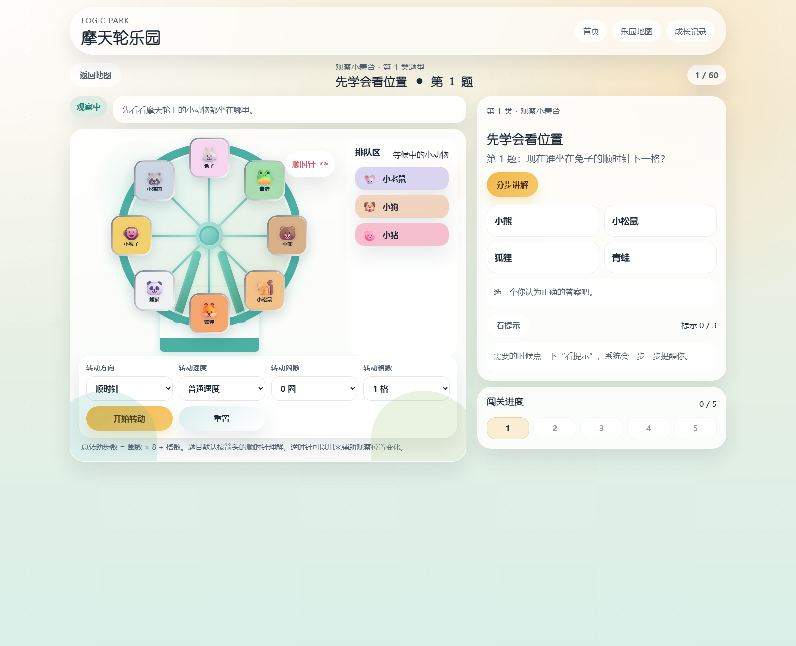
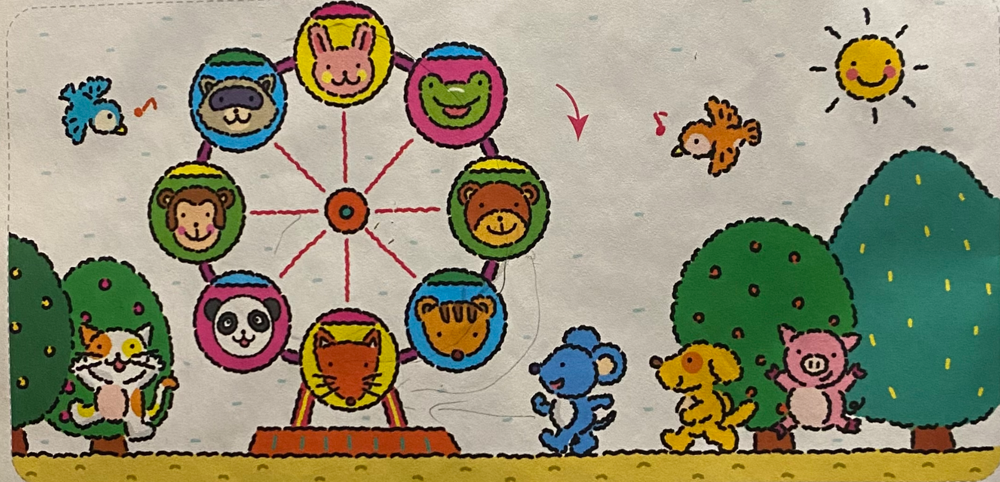

<div align="center">
  <h1>Children-Games</h1>
  <p>一个把“坐摩天轮”逻辑题做成网页互动闯关的儿童启蒙小游戏。</p>
  <p>
    <a href="https://mrity.github.io/Children-Games/">在线试玩</a> ·
    <a href="#本地使用">本地运行</a> ·
    <a href="#题型结构">题型结构</a> ·
    <a href="#github-pages-发布">发布说明</a>
  </p>
</div>

<p align="center">
  
</p>

一个基于“小学生摩天轮逻辑题”改编的儿童网页启蒙游戏。项目使用纯 `HTML + CSS + JavaScript` 开发，不依赖打包工具，双击 `index.html` 就能打开，也可以放到局域网或 GitHub Pages 上直接给孩子使用。

## 项目亮点

- 单页网页游戏，打开即玩，不需要安装依赖
- 3 个主题区域：观察小舞台、摩天轮乐园、排队小广场
- 12 类题型，共 60 道题，每类 5 题
- 支持顺时针 / 逆时针观察和真实感转动动画
- 支持设置转动方向、速度、圈数、格数
- 支持提示、分步讲解、自动进入下一题
- 按答题次数给出 3 星 / 2 星 / 1 星评价
- 自动保存学习进度到浏览器本地
- 支持进度导出 / 导入
- 支持局域网脚本，家里多台设备可直接访问

## 项目简介

原始题目来自“坐摩天轮”逻辑思维题，核心训练点是：

- 顺序观察
- 位置判断
- 顺时针转动推理
- 排队上车规则理解
- 同高位置关系判断

当前版本把纸面题扩展成了可交互的网页游戏，让孩子可以一边观察摩天轮，一边点击作答，还可以查看提示和分步讲解。

## 玩法流程

1. 先观察摩天轮上每只小动物的初始位置。
2. 根据题目设置转动方向、圈数和格数，辅助理解位置变化。
3. 从候选答案里选择正确结果。
4. 如果答错，可以看提示或播放分步讲解。
5. 答对后系统会自动评分并进入下一题。

## 题型结构

### 区域一：观察小舞台

| 类别 | 题型名称 | 训练点 |
| --- | --- | --- |
| 1 | 先学会看位置 | 找顺时针下一格 |
| 2 | 找同样高的小伙伴 | 判断谁和谁一样高 |
| 3 | 认识最高的位置 | 找最上面的位置 |
| 4 | 认识前后位置 | 找逆时针前一格 |

### 区域二：摩天轮乐园

| 类别 | 题型名称 | 训练点 |
| --- | --- | --- |
| 5 | 转到指定位置 | 转到目标后再找同高 |
| 6 | 转动后再找同高 | 换一组动物继续推理 |
| 7 | 转几格看谁来 | 谁坐到某个原来的位置上 |
| 8 | 转几格看终点 | 某只动物会到谁原来的位置 |

### 区域三：排队小广场

| 类别 | 题型名称 | 训练点 |
| --- | --- | --- |
| 9 | 排队后看位置 | 目标动物到位后再看别人的位置 |
| 10 | 谁先坐到底部 | 看刚上车时坐在哪个位置 |
| 11 | 第二只小动物去哪儿 | 目标动物到位后再看另一只 |
| 12 | 最上面的新朋友 | 目标动物到位后看最上面 |

## 页面内容

| 模块 | 说明 |
| --- | --- |
| 首页 | 介绍玩法、主题和入口按钮 |
| 乐园地图 | 展示 12 类题型和当前解锁状态 |
| 游戏页 | 显示摩天轮、控制参数、排队区、题目、提示和讲解 |
| 成长记录 | 汇总完成进度、星级和导入导出功能 |

## 项目文件

- `index.html`：页面结构和主要界面
- `style.css`：整体视觉样式和响应式布局
- `app.js`：题库、动画、答题流程、进度系统
- `pic.png`：原始题图
- `question.md`：原始题目文字
- `start-lan-server.cmd` / `start-lan-server.ps1`：启动局域网访问
- `stop-lan-server.cmd` / `stop-lan-server.ps1`：停止局域网访问

## 本地使用

### 方式一：直接打开

直接双击 `index.html`，或在浏览器中打开该文件。

### 方式二：局域网访问

在 Windows 上双击：

```bat
start-lan-server.cmd
```

启动后脚本会显示：

- 本机访问地址
- 局域网内其他设备可访问的地址

停止服务时运行：

```bat
stop-lan-server.cmd
```

## GitHub Pages 发布

仓库已经加入 GitHub Pages 自动发布工作流：

- 工作流文件：`.github/workflows/deploy-pages.yml`
- 触发方式：每次推送到 `main` 分支后自动发布
- 发布内容：只发布网页运行需要的静态文件

首次启用时，如果仓库还没有开启 Pages，需要到 GitHub 仓库页面手动确认一次：

1. 打开 `Settings`
2. 打开 `Pages`
3. 在 `Build and deployment` 里确认 `Source` 使用 `GitHub Actions`

发布成功后，项目地址通常是：

```text
https://mrity.github.io/Children-Games/
```

如果你已经看到仓库里有 `Deploy GitHub Pages` 工作流，那么只要 `main` 分支有新提交，页面就会自动重新发布。

## 技术说明

- 无需安装 Node.js 依赖
- 无需构建步骤
- 所有题目数据都内置在 `app.js`
- 学习进度保存在浏览器 `localStorage`
- 发布到 GitHub Pages 时不包含备份和恢复用的辅助文件

## 原始题目

题目文本见 `question.md`，核心示例包括：

- “如果狐狸转到小猴子的位置上，那么谁与小松鼠一样高？”
- “如果兔子的位置转到小熊的位置上，那么谁与熊猫一样高？”
- “如果排队的小老鼠坐到小熊的位置上，那么小猪会坐到哪个位置上？”

<p align="center">
  
</p>
